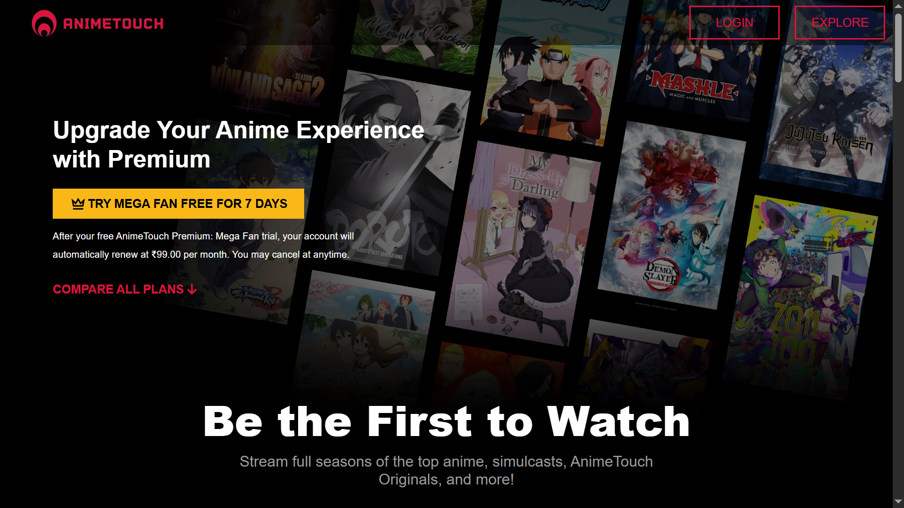

# 🎥 AnimeTouch – Anime Streaming Platform



**AnimeTouch** is a fast, responsive anime streaming platform built with **React.js**, **Bootstrap**, **Node.js**, and **Express.js**. It offers users a smooth interface for discovering, watching, and navigating through anime content.

## 🌐 Live Preview

👉 [Visit AnimeTouch](https://animetouch.vercel.app)

---

## ⚙️ Tech Stack

**Frontend:**
- React.js
- Bootstrap 5
- Axios
- React Router DOM

**Backend:**
- Node.js
- Express.js
- MongoDB (via Mongoose)

---

## 🚀 Features

- 🎞️ Browse & stream anime series with responsive UI
- 🔍 Real-time search and category-based filtering
- 📱 Mobile-first design for enhanced viewing
- 🚀 50% faster response time by optimizing backend structure
- 📊 25% increase in user retention through streamlined UX

---

## 📦 Setup Instructions

```bash
# Clone the repo
git clone https://github.com/your-username/animetouch.git
cd animetouch

# Start frontend
cd client
npm install
npm run dev

# Start backend
cd ../server
npm install
npm run dev
```

## 📃 License
MIT License © 2024 by Ragav
